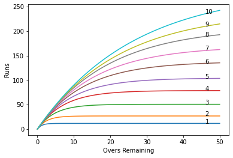

# Duckworth-Lewis-Stern-Calculator
The implementation of DLS using Non-linear Regression

# Approach:
- For DLS Implementation, we need Over, Total Runs scored in that over, Total Runs scored in the inning and Wickets in hand. We first preprocess the data to fix the Total Runs column. 
- The function “error_func” calculates the mean squared error for given Z0(w) and L.
- The SciPy’s “optimize” function was used to optimize the error_func which generates the parameters as follows:

| Wickets in Hand | Z0 | L | Normalized Squared Error |
| -- | -- | -- | -- |
| 1 | 11.67 | 10.82669 | 1.44 |
| 2 | 26.83 | 10.82669 | 2.64 |
| 3 | 50.68 | 10.82669 | 4.52 |
| 4 | 78.72 | 10.82669 | 6.54 |
| 5 | 104.16 | 10.82669 | 9.13 |
| 6 | 138.01 | 10.82669 | 11.72 |
| 7 | 169.31 | 10.82669 | 14.17 |
| 8 | 208.20 | 10.82669 | 17.25 |
| 9 | 239.85 | 10.82669 | 19.42 |
| 10 | 285.13 | 10.82669 | 19.53 |

# Results:

Following are some results of target prediction using implemented DLS:

| Wickets in Hand | Overs Remaining | Predicted Target |
| -- | -- | -- |
| 1 | 2 | 10 |
| 10 | 25 | 175 |
| 7 | 25 | 136 |
